# Fluffy and Rory Adventures in FarmBot

My young friend, who also has the awesome name of Rory, and I have decided to try and build a farmbot. We find it very cool what you are building and the way you are trying to make it all open source. If it is OK with folks, we thought we would post on this thread bits about our progress, challenges, what we are attempting to solve those, and random ideas for cool improvements. The goal being to share info that would be useful to others and at the same time get help from the community. Huge thanks to my friend Rick who got me going on this.

# Ordering Parts - Day 0 

Let me just start by saying I can't wait till I can jut go to the farmbot.io online store click "send me the whole thing" and be done. Most the parts I got from the sites suggested in the documentation.

We got the Plates from using the DXF file from 1.0 and had them cut by JP Metals in Calgary for approximately $200 US out of 3/16 aluminum. (not the 5mm in design).  Note the right way to get the DXF file is to go to the current CAD drawings in onshape, go to the Meta directory, then go to "all plates layout (flat)".  One thing we noticed is that seems to be missing the end bracket to mount the motors for the x axis. I think we will use the drawings from 1.0 to try and make one using a hacksaw and drill press. May try to cut with CNC router at some point.

The 1.1 drawings have a nice bent mental version of the Z motor mount but I think we will try and 3d print the one from the 1.0 drawings instead. 

I have no idea if the stepper motors and encoders we got will work but we ordered the stepper motor from inventables part number 25253-01 (https://www.inventables.com/technologies/stepper-motor-nema-17) and an AMT102-V encoder from digikey (http://www.digikey.ca/product-detail/en/cui-inc/AMT102-V/102-1307-ND/827015). How the encoder mounts on the motor is still an "miracle happens here step" but we might try to glue the encoder on to the motor. Any advice appreciated.  The motor is a SM42HT47-1684B from smart automation (http://www.smartautomation.com.cn/ProductShow.asp?ArticleID=498). In looking for steppers, I found googling for 42HT47 useful as well as the page at (http://reprap.org/wiki/NEMA_17_Stepper_motor). The motor is rated 2.8V, 1.68 A per phase, 0.438 N*m torque, and a step angle of 0.9 degrees. 

To run the PI camera over an HDMI cable, I got the "Pi Camera HDMI Cable Extension" from Petit Studio (https://www.tindie.com/products/freto/pi-camera-hdmi-cable-extension/ ). Perhaps a USB camera would be a better idea. Will see what happens.

The RAMPS shield seemed to be out of stock most places but (http://www.sainsmart.com/) had them. All the stuff from sainsmart arrived quickly in nice case. I had not ordered from them before but I will use them again.

Update: the cable carriers from inventables had a bend radius that was too large and did not work. Hoever the smaller 15mm x 30mm carriers from inventables look like they might work.

# Building Tracks - Day 1

We set up the tracks to be about 1m by 1m space because it -20C outside right now and we plan to learn how to build this farmbot by making a mini-farmbot inside this winter then rebuilding it to a full size one outside in the spring. Questions that came up:

* How exact does the width of the track need to be from one end to the other?

And tip for next time, if the y gantry bar is 1m long, then that needs to match the distance from the *outside* of track on one side to the *outside* of track on other side.

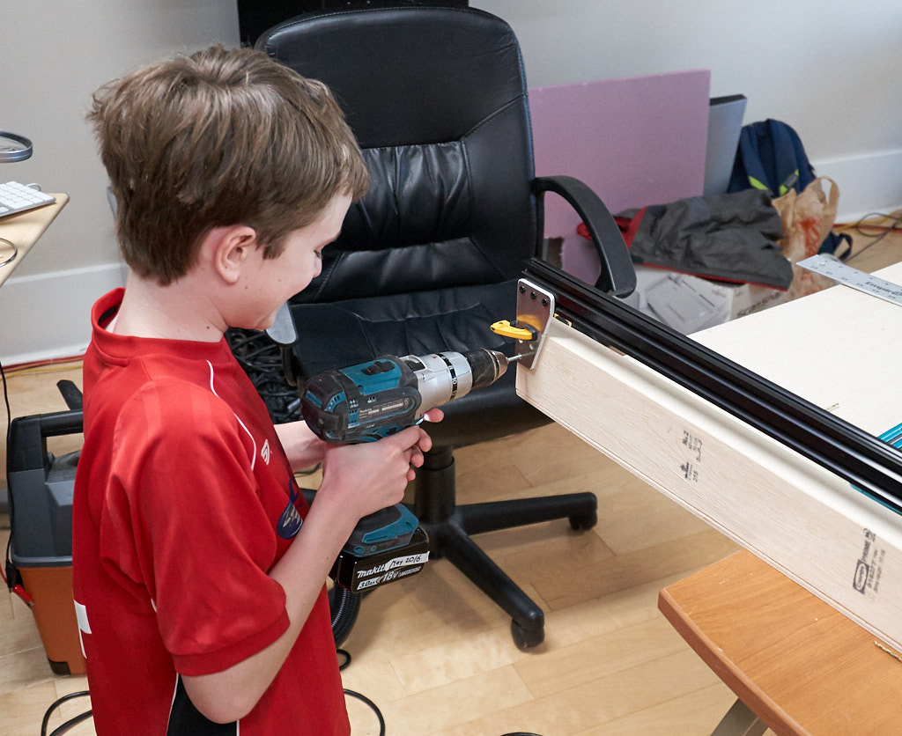

# Building Wheels and Mounts for Gantry - Day 2

Anyone have good input on easies way to get the location of the wheels adjusted?

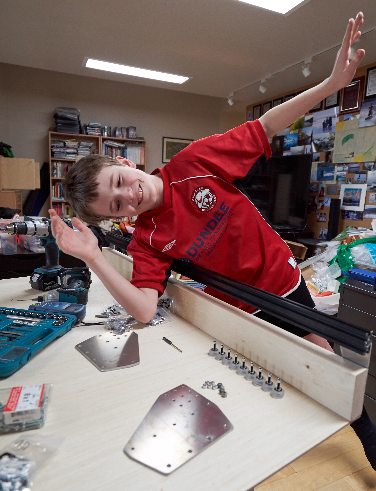

# Building Gantry - Day 3 

Used lots of clamps and squares to try and get everything lined up square.

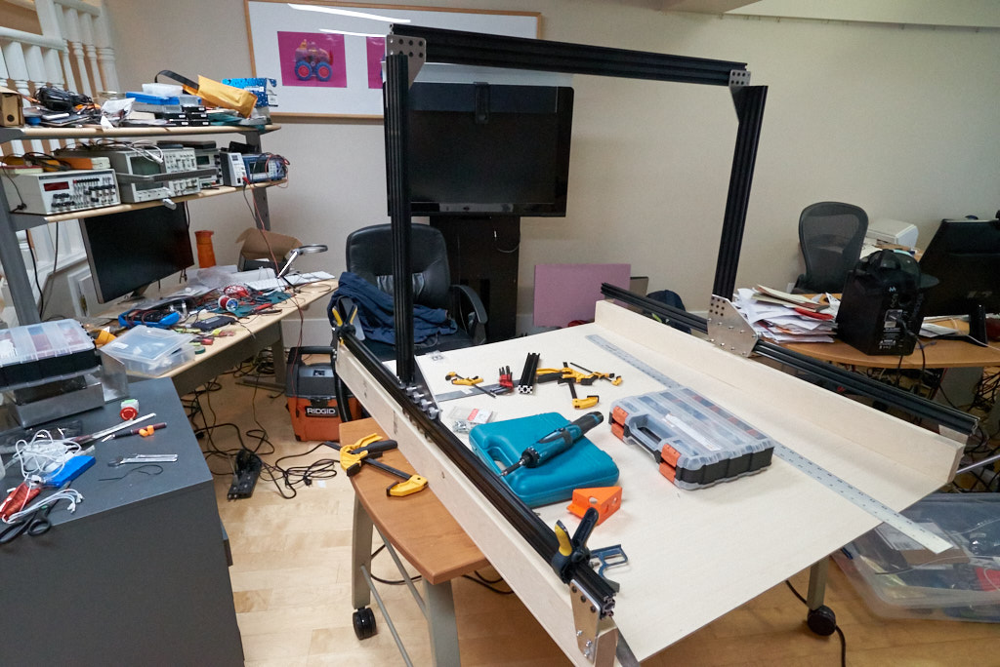

# Building X Axis Drive Train - Day 4

Because we love instant gratification and, well, we want to see it move, we are going to try and get the X axis all connected up to web site and moving before building y and z.

The DXF files we used to get the cut plates did not include the correct corner brackets. We used what we did get on one side.

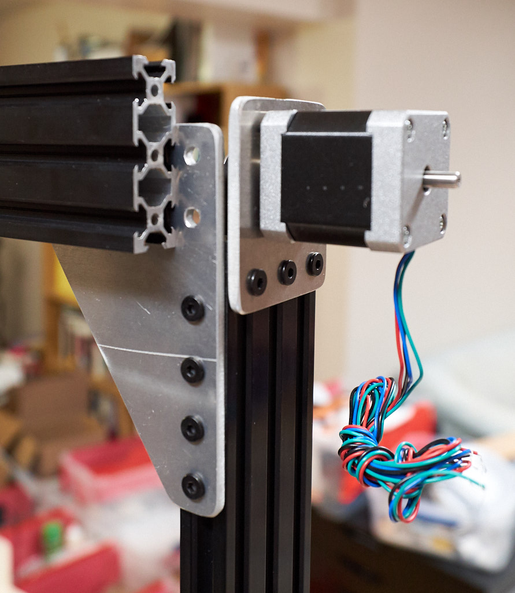

On the other side  we used a drill press and hacksaw to make one

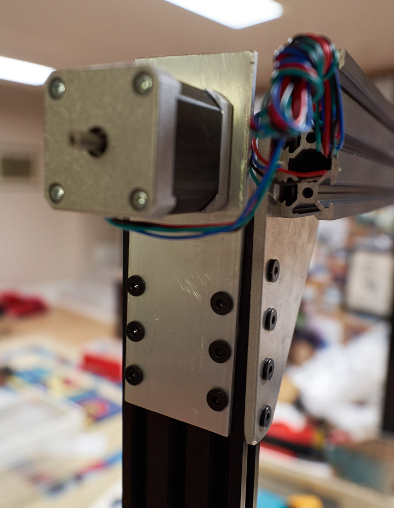

If I was doing this again, I would consider order the end plate that vikhyat had designed at http://forum.farmbot.org/t/gantry-corner-bracket-drawing/1082 

## Setting up the Controller

Totally failed to get this to work until I attached a serial console to the Raspberry PI  to see what is going on. Would be nice to have all the log data show up on the web site but even with that, probably need a serial console to deal with errors getting on WIFI and such.

## Arduino firmware

Ran into bug (https://github.com/FarmBot/farmbot-arduino-firmware/issues/42) so can't get the X asis moving. Will have to decide how to attack this problem. Looking at the code, I think I might try a patch that any time the pins for the X1 motor are set, the corresponding pins for the X2 motor are also set.

# Build Cross Slide - Day 5

## Arduino Firmware Hacking

Wrote a little PR to fix the Arduino software so now it drives both X motors. Remember to wire one of the motors to go backwards. This can be done by flipping the connector upside down where the motor plugs into the RAMPS shield. 

## 3D Printing

Downloaded universal tool mount base from OnShape as STL. Loaded in CURA. Flipped upside down. Printed in PLA with high speed setting and no supports. Print time 2 hours with 41 grams of PLA on a Lulzbot mini.

## Build Cross Slide

I wonder if anything should be changed to reduce backlash on z axis screw?

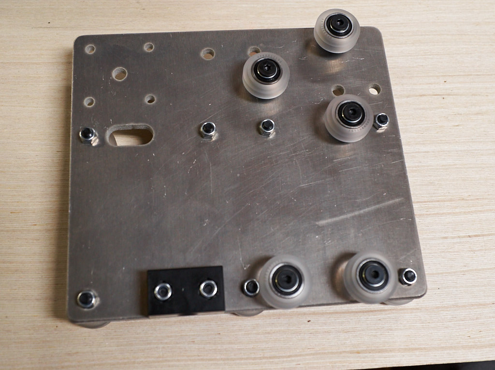

# Build Z Axis - Day 6

Was going to print motor mount out of nylon which would be much stronger but did a test run with PLA. The PLA version seems very strong (I can stand on it) so think I might just use that. I did not use any supports when I printed it and that left some weirdness in the hole for the wires. Should redo that hole so that it has a 45 degree ramp when printed and does not need to be printed with supports.

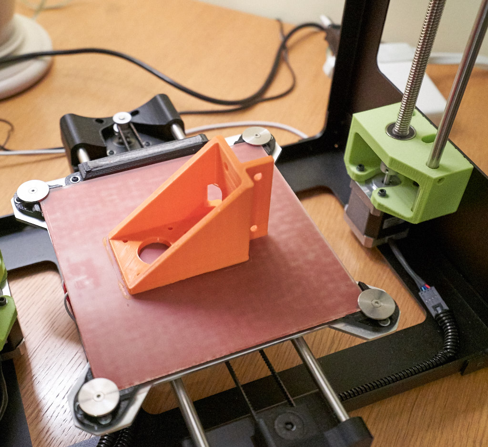

Wishing the wire I got to connect up the motors was smaller and more flexible. Think I would use a cable with 8 wires each stranded 22 gage.

# Water and Wiring - Day 7

Wired up Y and Z stepper motors. Do not have encoders yet. The orientation of the stepper motors is red wire down for all of them except the 2nd X more which runs in the revere direction with red wire up.

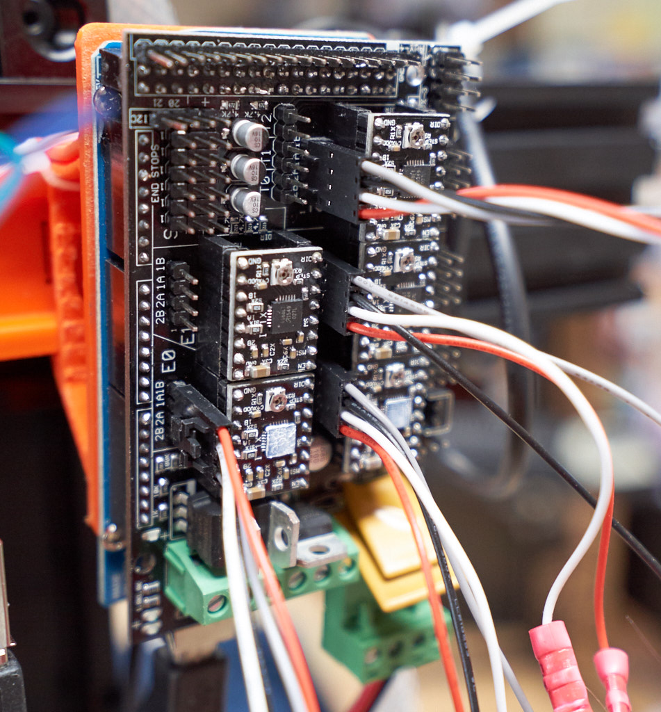

The serial console cable wiring for the PI has green in ground, blue is transmit from PI and red is receive. It looks like. 

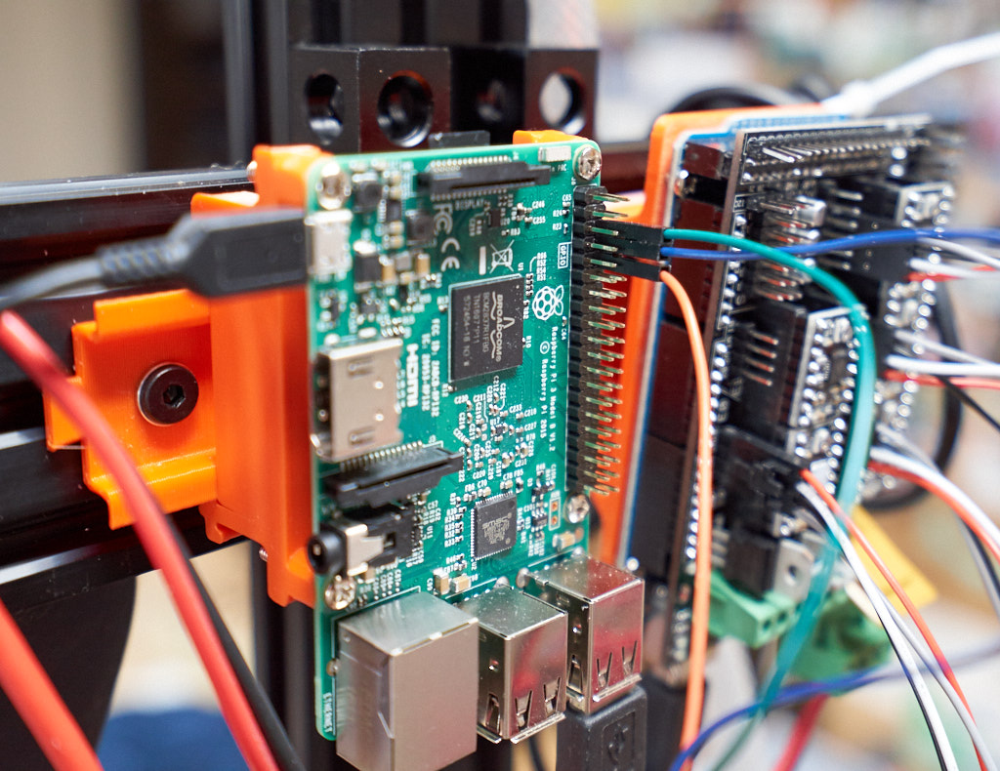

The water is supplied by a small marine bilge pump. It does not really provide enough pressure to lift the water a high as we would like so the reservoir of water needs to be pretty high. Need to find a better pump. 

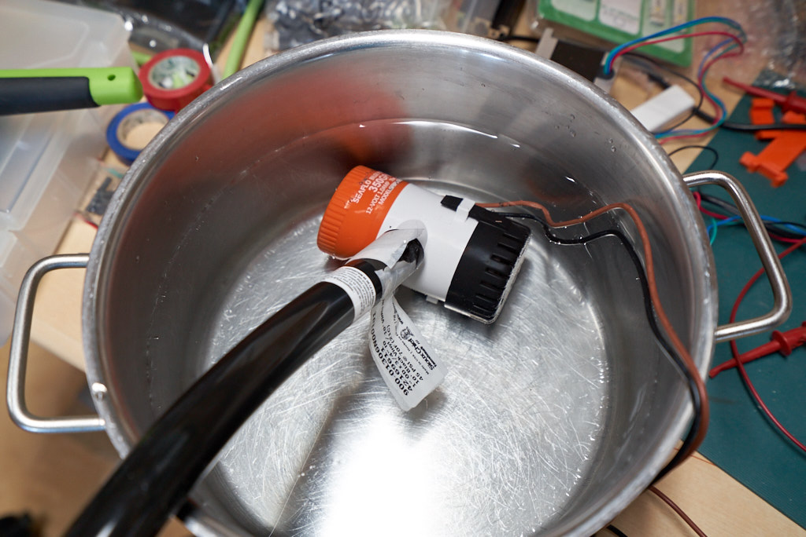

We could not find the small barbs in the design so we took a 1/8 inch barb then drilled a 3/16 inch whole in the mount and push the barb into the mount with a vice. Then we connected another barb for the 1/4 water line to that one.

The holes to mount the universal tool mount (UTM) to the z axis are very close together and did not have enough space for two t-nuts on be side by side in the track. The M5 t-nuts in the 1.1 onshape design have a length of 10 mm which just works. Unfortunately the t-nuts we got (http://openbuildspartstore.com/tee-nuts-25-pack/) are 15 mm long so are too long to fit between the two holes on the UTM. ~~~Might fix this by hacksawing a few t-nuts to be a bit shorter. ~~~ Fixed this by using  the post assembly t-nuts from inventables (https://www.inventables.com/technologies/post-assembly-t-slot-nuts) which do work. 

* One idea that came up was: Why not have the barbs be just part of the 3d printed plastic so that the tube just pressed onto the tool mount directly and perhaps had a hose clamp.

We are pretty excited that the current thing we have built moves and squirts water.

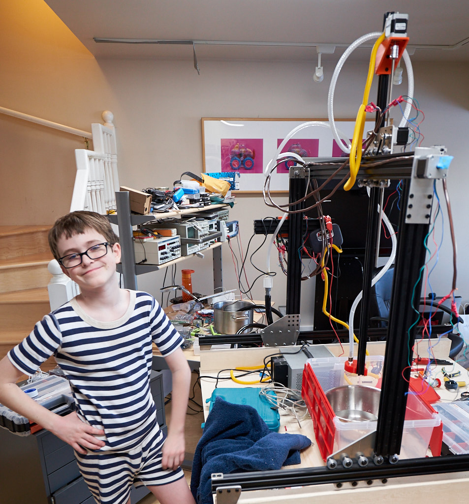

# Calibration and Mounts - Day 8 

We added the tool mount.

For the calibration of the pulses per mm of movement on the x and y axis we calculated how far 200 pulses would move. No micro stepping so 200 pulse = 200 steps. The step angle is 0.9 degrees so this would be 180 degrees or half a revolution. The gear has 20 teeth so in the half revolution, the belt would move the distance of 10 teeth. The belt is GT2 and the teeth are 2 mm apart so the 10 teeth worth of rotation would move the belt by 20 mm. So our system needs 10 pulses per mm in X and Y. Each motor can pull the belt with about 35 lbs of force. 

For the Z axis, the screw moves 8 mm per revolution. So 200 pulses is half a resolution and moves it 4 mm. So our system needs 50 pulses per mm in the Z. It can generate around 175 lbs of force. 

We have not figured out how to set up the pulses per mm in configuration. Currently our x,y moves move 1/5 the distance they should and the z moves 1/25.

# Tools - Day 9

3D printed some more tools and put magnets in the UTM and tools. Amazing how well the magnets work.

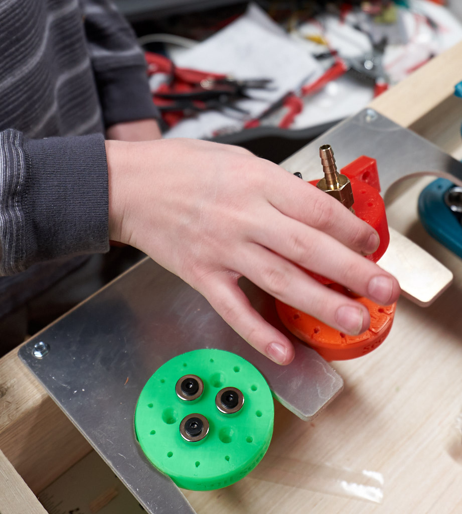

# Cable Carriers - Day 10

Added the cable carriers but ran into what looks like it might be a bit of a part problem (or perhaps design problem). 

The design calls for the cable carriers with a bend radius of 28mm (See https://farmbot-genesis.readme.io/docs/electronics-and-wiring#section-cable-carrier). By bend radius, I am measuring the radius to the center of the carrier (not top or bottom). When I measure the radius needed for the z carrier, I get 53.5mm from back of cross slide plate to front of z axis cable carrier implying a bend radius a tad under 27 mm but 28 would probably work fine. However, the problem is that looking at the datasheet of the drag cable from the DragChain.pdf file found at https://www.inventables.com/technologies/drag-chain, the bend radius of this drag cable looks like it might be 38mm. Perhaps it is available in 3 different radius but what inventables is shipping has a bend radius of 38 mm and does not work. 

The smaller drag cable that is 15x30 from inventables does have a bend radius of 28 mm so we are trying to use that for the z axis. Not sure if everything will fit. The mounting holes don't line up and the carriers brackets are too wide but it looks like it will probably work.

Here is a side view of the z-axis drag cable where it mount at the cross slide plate. You can see the bend is tight with this 28 mm bend radius and no chance 38mm would work. 

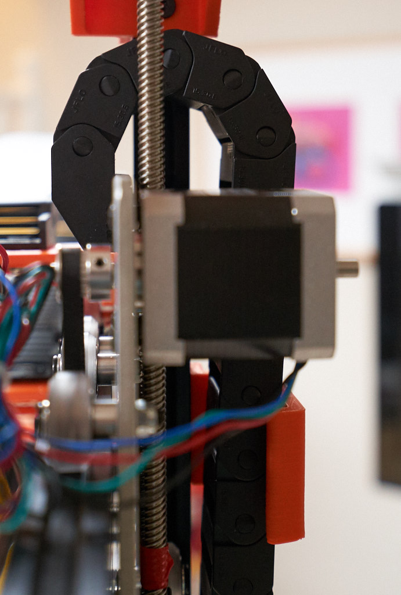

And here is a photo of 3D printing three of the cable carrier brackets.

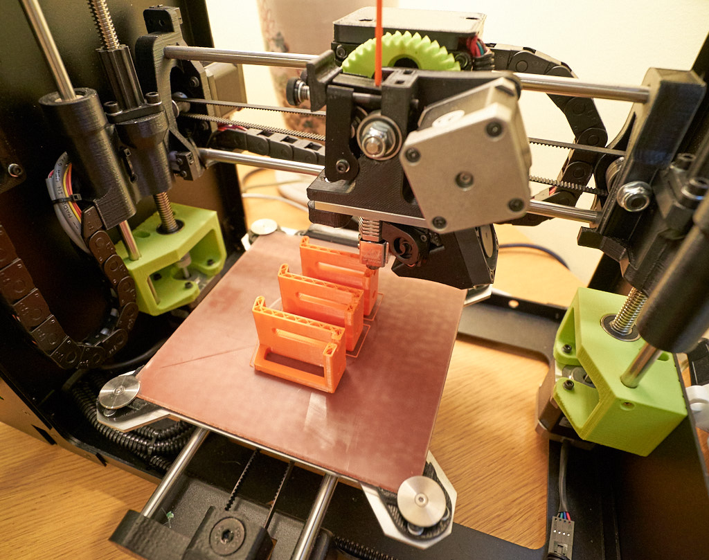

